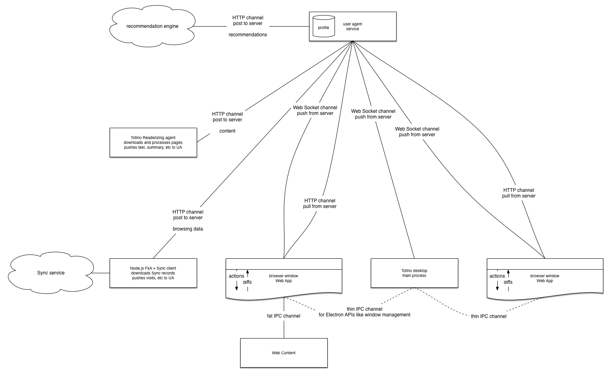

# User Agent service

Tofino has a single centralized User Agent (UA) service.  Currently, the User Agent service runs in
the main Node.js process, but we're interesting in experimenting with an architecture where a
persistent UA service runs in a separate long-lived process and Tofino connects to the service on
startup.  We're also interested in hosting the UA service remotely and exploring what cloud-based
extensions of the user agent might be able to achieve. like.

The main process, and each browsing window, connect to the UA service.  They communicate with it
over standard "Web Platform" channels: HTTP and Web Sockets (WS).  They send browsing events (like
"the bookmark star was tapped" or "this link was clicked") over HTTP and receive updates (like "the
set of bookmarks pages is now ..." or "the Top Sites list is now ...") over WS.

Future User Agents -- including ones that might not resemble a traditional desktop or mobile browser
-- can ingest data into the User Agent service independently of the main browsing interface.

## Architecture

Tofino tries to be a "standard Web App".  Electron mandates a main process, which handles opening
and closing Electron `BrowserWindow` instances and system integrations (such as updating the menu
displayed by the OS window manager).  Beyond that, each Browser Window is a Web App served from
locally hosted content and connecting to a locally hosted User Agent service.

The following diagram represents the high level "Web App" architecture:

## Runtime commentary

When the main process starts, it spawns a User Agent service and immediately connects to it over
WS.  The WS channel pushes initial state (like the current bookmarks) to the main process.  The
main process then opens a browser window (BW).  The BW also immediately connects to the UA
service over WS, receiving an initial state as well.  From this point forward, both the main
process and each BW receive changes to the UA service state (for example, the set of current
bookmarks) over WS.

In addition, each BW makes HTTP requests to the UA service to enable and record its browsing
activity.  For example, each new tab HTTP POSTs a fresh browsing session to the UA service, and
receives a unique session identifier in the HTTP response.

Each BW hosts a Redux loop to process sequential *actions* and update a monolithic *store*.  Each BW
renders its Redux store using React, although that is not critical to this discussion.  When another
client of the UA service (including another BW in the same Tofino instances) changes the UA state,
the original BW receives the change over the WS channel.  As these changes are received,
corresponding Redux actions are dispatched, updating the per-BW Redux store and triggering UI
renders.

The following diagram represents the data flow when the bookmark star button is tapped:

## Technical notes

### Transport layer

Currently, browsing windows communicate with the main process over the Electron-provided IPC
transport layer.  The main process and all browsing windows communicate with the User Agent service
over HTTP and Web Sockets.  This allows to easily use the full range of client-side Web App
technologies and libraries.

In the future, the transport layer might be over Electron's IPC layer, or even over a custom socket
protocol, as performance, compression, and other considerations influence the design.