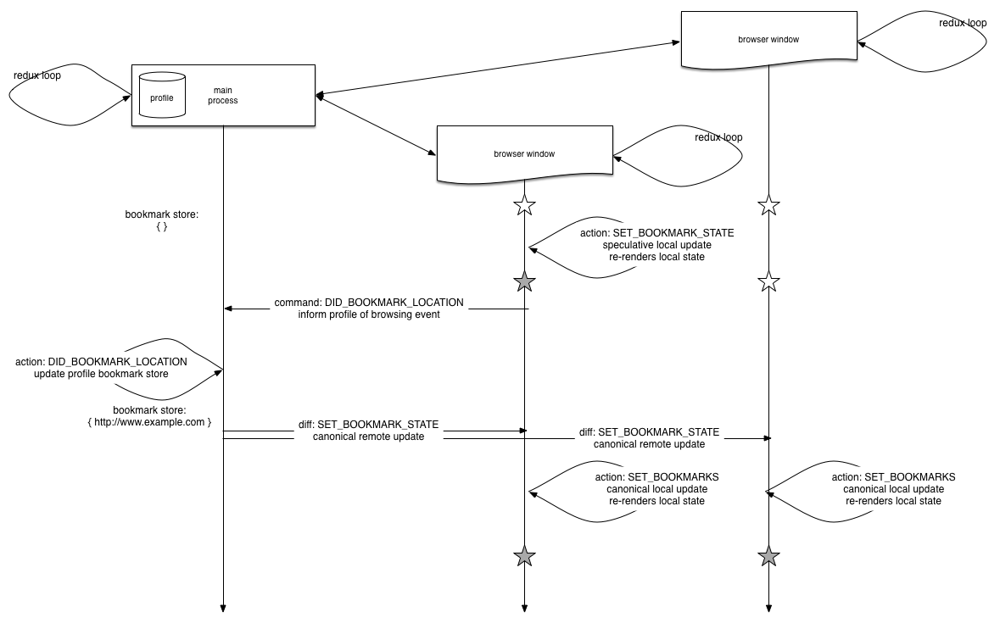

# Profile service

Tofino has a single centralized profile service that runs in the main Node.js process.  Each
browsing window communicates with the profile service, sending browsing events (like "the bookmark
star was tapped" or "this link was clicked") to the profile service and receiving updates (like "the
set of bookmarks pages is now ..." or "the Top Sites list is now ...") from the profile service.

## Architecture

Tofino implements a "full stack Redux" variant.

Each browsing window corresponds to an Electron `BrowserWindow` instance, which I will abbreviate to
"BW".  Each BW hosts a Redux loop to process sequential *actions* and update a monolithic *store*.
Each BW renders its Redux store using React, although that is not critical to this discussion.

The main process *also* hosts a Redux loop to process sequential *actions* to update a monolithic
*store*.  These actions cross the process boundary (always from one BW process to the main process)
and may be ignored or rejected by the profile service.  Since they may be rejected, we call them
*profile commands* to distinguish them from actions, which cannot be denied.  (This also helps
distinguish regular BW Redux "actions" from cross-process "profile commands".)  These profile
commands are profile server Redux actions.  They're reduced into a new profile service store, which
is then "rendered" by sending updates from the profile server to one or more BWs.  We call such
updates "profile diffs", since they generally do not replace the entire BW state but instead update
some part of it.  (Again, this naming helps to distinguish regular BW Redux "actions" from cross
process "profile diffs".)  This flow is similar to React's virtual DOM diffing, but done manually
and across the process boundary.

## Example diagrams

The following diagram represents the data flow when the bookmark star button is tapped:



## Commentary

The main process is translating between two sets of states: the entire "profile state" and many "BW
states". A profile command cannot be directly applied to a BW store to yield a new BW store.  Only
BW actions can.

From the BW's perspective, it's receiving profile diffs (from the back-end) and reducing its
existing BW store.  That's not the same as the profile service's perspective:

* BW clicks bookmark star, visits a URL, whatever.
* BW action is generated.
* optionally, BW action speculatively changes BW store.
* BW sends profile command to profile service.
* Profile service reduces profile command.
* Profile service sends profile diff to BW.
* BW reduces profile diff yield new BW store.

## Formalism

We use a lower case trailing `p` or `bw` to refer to "profile" and "browser window", respectively.
(Read these as subscripts.)  Denote a store by "S" and a Redux action by "A".

Formally, the main process is:

* A state `S_p`.
* A reducer `R_p(A_p, S_p) => S'_p`.

And a "translator" to turn "profile" stores into (partial) "browser window" stores:

* `T(S_p) => S_bw`

And a "differ" to turn "profile commands" into "browser window actions" to update an existing
"browser window" store:

* `D(S_p, A_p) => A_bw`

Formally, each BW is a standard Redux loop:

* A state `S_bw`.
* A reducer `R_bw(A_bw, S_bw) => S'_bw`.

The invariant is that reducing the differ's profile diff against the browser window store must be
the same as translating the reduction of the profile command against the profile store:

```
R_bw(D(S_p, A_p), S_bw) = T(R_p(A_p, S_p))
```

## Technical notes

### Transport layer

Currently, browsing windows communicate with the profile service over the Electron-provided IPC
transport layer.  In the future, the transport layer might be a Web Socket connection, or it might
be a (persistent) HTTP connection.
